# Tarea 4 Verificacion Funcional - Codificación

Autores:
- Víctor Sánchez Alpízar
- Juan Pablo Ureña Madrigal

Profesor:
- Luis Adolfo Alfaro Hidalgo

El presente documento tiene como finalidad:
- Explicar el funcionamiento principal de la interfaz desarrollada para el SSH.
- Explicar el funcionamiento de las funciones de simulación diseñadas para poder generar pruebas y escenarios diferentes en SSH.

## Interfaz principal.

### Menu de Inicio

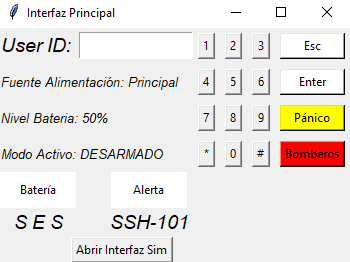

En esta sección el sistema espera por el ingreso de un usuario y su contraseña. De forma predefinida se encuentran los siguientes usuarios:
- Usuario 1. ID: 1. PWD: 1234.
- Usuario 2. ID: 2. PWD: 2341.
- Usuario 3. ID: 3. PWD: 3412.
- Usuario 4. ID: 4. PWD: 4123.
- Usuario 5. ID: 5. PWD: 5555.
Nota: Posteriormente, estos usuarios pueden, y deben, ser modificados para mantener la privacidad del usuario.

Adicionalmente, en esta interfaz se muestra información de importancia para el usuario:
- La fuente de alimentación seleccionada por el módulo.
- El nivel de la batería de respaldo.
- Modo Activo (incialmente será Desarmado).
- Botones "Pánico" y "Bomberos".

Así como los indicadores LED "Batería" y "Alerta", además del nombre del modelo e identificador.

Finalmente, se encuentra el botón "Abrir Interfaz Sim", el cuál no estará disponible en la versión del cliente, pero es importante para ofrecer distintas opciones de simulación.
- Este modo es principalmente útil para técnicos que requieran determinar si el sistema se encuentra funcionando integramente y poder detectar posibles fallas.

Al seleccionar un usuario se presentará la pantalla de Contraseña:

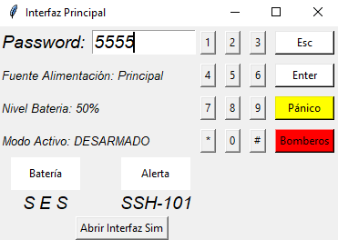

A continuación, el sistema le pedirá al usuario que indique el nivel de batería por debajo del cuál se debe alarmar.

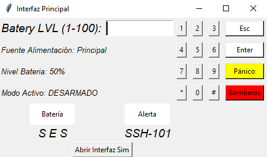

### Menu Principal

Una vez que la configuración inicial del usuario se encuentra preparada, el sistema entrará al Menu Principal.

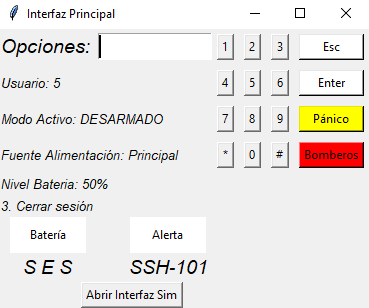

En este menú se despliega información de relevancia tal como:
- Usuario activo.
- Modo Activo.
- Fuente de alimentación seleccionada.
- Nivel de Batería.
- Cerrar Sesión de Usuario.

En esta interfaz el usuario puede interactuar con el sistema de las siguientes formas:
- Ingresar códigos de Modo para poder ingresar a las distintas opciones disponibles.
- Enviar mensajes de auxilio tales como "Pánico" y "Bomberos".

### Modo Admin

### Modo 0 y Modo 1

En esta sección se describen los modos **0** y **1** del sistema, los cuales permiten monitorear sensores de zonas específicas. Para acceder a cada uno, el usuario debe estar activo e ingresar la secuencia correspondiente:

- `#123456*` para **Modo 0**
- `#234567*` para **Modo 1**

En el **Modo 0**, se monitorean todos los sensores de la **Zona 0**.

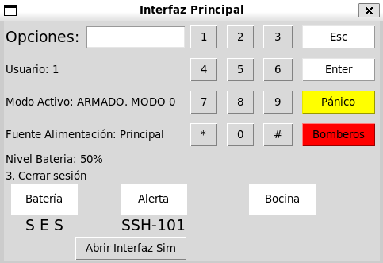

En el **Modo 1**, se monitorean los sensores de la **Zona 1**.

En ambos modos, se recomienda utilizar la **interfaz de simulación** para activar o desactivar sensores y verificar el funcionamiento del sistema de alertas.

#### Comportamiento de las alertas

- En el **Modo 0**, si se activa un sensor de la **Zona 0**, el sistema genera una alerta:

  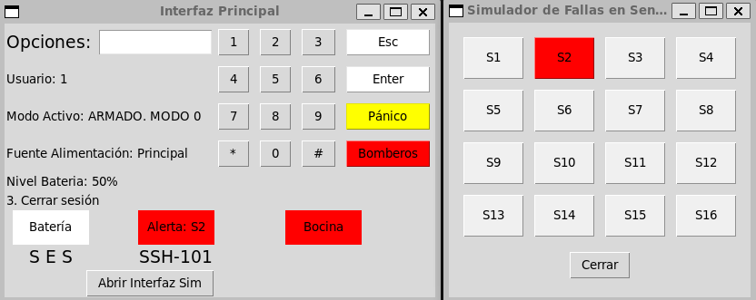

- En el **Modo 1**, únicamente los sensores de la **Zona 1** generan alertas. Por ejemplo, si se activa un sensor de la **Zona 0**, no se produce ninguna respuesta del sistema, como se muestra a continuación (este comportamiento es análogo en ambos modos cuando se activa un sensor que no pertenece a la zona actual):

  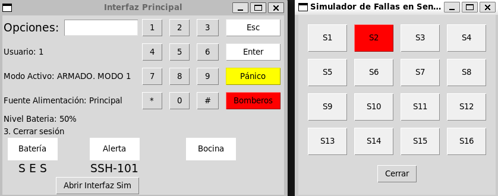

#### Consola del sistema

Durante la simulación, la **consola** muestra información útil como:

- El **tiempo de salida** al momento de armar el sistema.
- El **tiempo de desarmado** tras la activación del sensor principal ("S1").
- Las **alertas generadas por el módulo MSM**.

#### Restricción al armar el sistema

El sistema **no permite ser armado** si algún sensor se encuentra activo en el momento de ingresar el código. Este comportamiento se muestra en la siguiente figura:

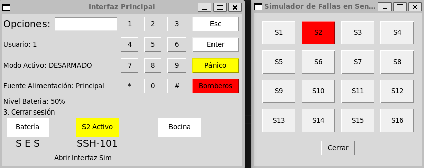

### Modo Desarmado

Una vez que el usuario está activo y se ingresa la secuencia de código `#345678*`, el sistema entra en el **Modo Desarmado**.

En este modo, se deja de monitorear cualquier sensor y todas las alertas del sistema se desactivan.

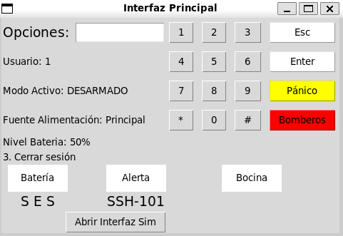

### Modo Ahorro

Una vez que el usuario está activo y se ingresa la secuencia de código `#567812*`, el sistema entra en el **Modo Ahorro**.

En este modo, **se monitorean todos los sensores del sistema**, sin importar la zona a la que pertenezcan. Sin embargo, los sensores **secundarios** (es decir, todos excepto el sensor principal) se desactivan automáticamente después de un tiempo determinado, lo cual permite que el usuario pueda salir sin generar alertas por pasos accidentales.

El tiempo de salida es mostrado en la **consola**, y una vez transcurrido, los sensores secundarios quedan desactivados. Si uno de estos sensores se activa después de ese tiempo, **no se genera ninguna alerta**, como se muestra en la siguiente imagen:

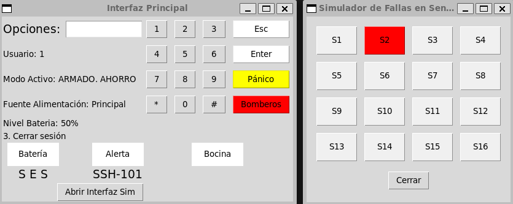

Sin embargo, si el **sensor principal** se activa, el sistema vuelve a **activar todos los sensores secundarios**. En ese caso, si alguno de ellos está activo, se genera una alerta:

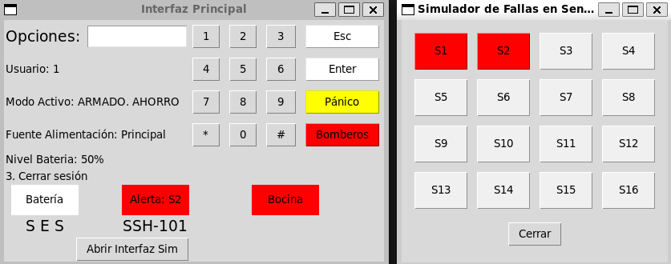

Durante todo este proceso, la **consola** permite monitorear el comportamiento del sistema, incluyendo:

- El flujo de activación y desactivación de sensores.
- Los **mensajes de alerta** generados por el módulo MSM.
- El **tiempo de salida** (para salir del área sin generar alertas).
- El **tiempo de entrada** (que permite desarmar el sistema tras activar el sensor principal, antes de que se dispare una alerta).

Este modo está diseñado para ofrecer **flexibilidad y ahorro de energía**, permitiendo salidas temporales mientras se mantiene un nivel de seguridad adecuado.

## Interfaz de Simulación

Al presionar el botón "Abrir Interfaz Sim" es posible acceder a opciones para testear diferentes funciones del SSH.

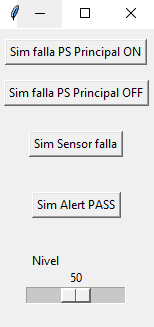

En este menú se pueden realizar las siguientes opciones:
- Establecer falla en la fuente "Principal" de energía.
- Limpiar falla en la fuente "Principal" de energía.
- Menú para fallas en sensores. Este Menú ofrece opciones para probar los 16 sensores disponibles por el sistema.
- Limpiar fallas (debido a botón de "Pánico", "Bomberos" o "Sensores")
- Nivel. Indicar el nivel actual de la batería. Al mover este indicador de 0-100 se puede probar que sucede cuando una falla en la fuente "Principal" ocurre y el nivel de batería varia.

Para el caso del Menú para fallas en sensores, se tiene la siguiente interfaz:

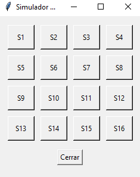

Cada botón presente en el menú anterior ofrece opciones para alertar cualquiera de los 16 sensores.
